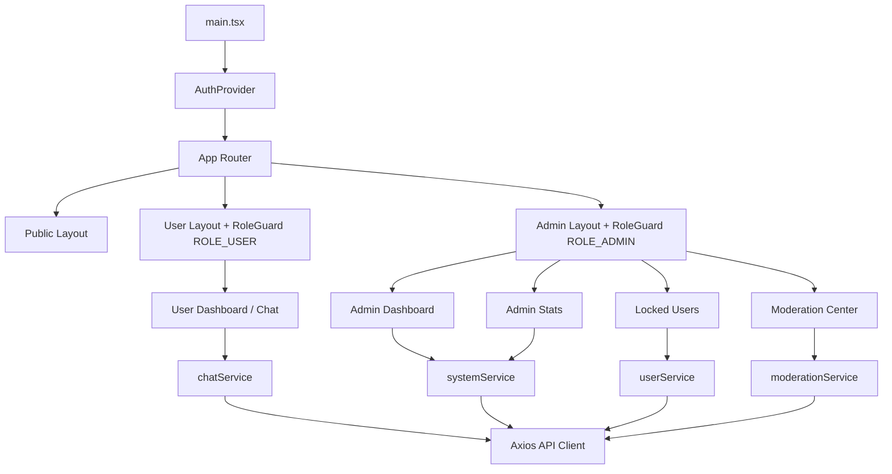
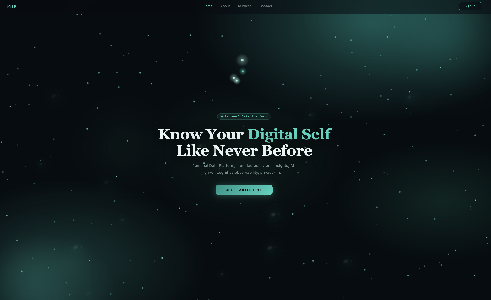
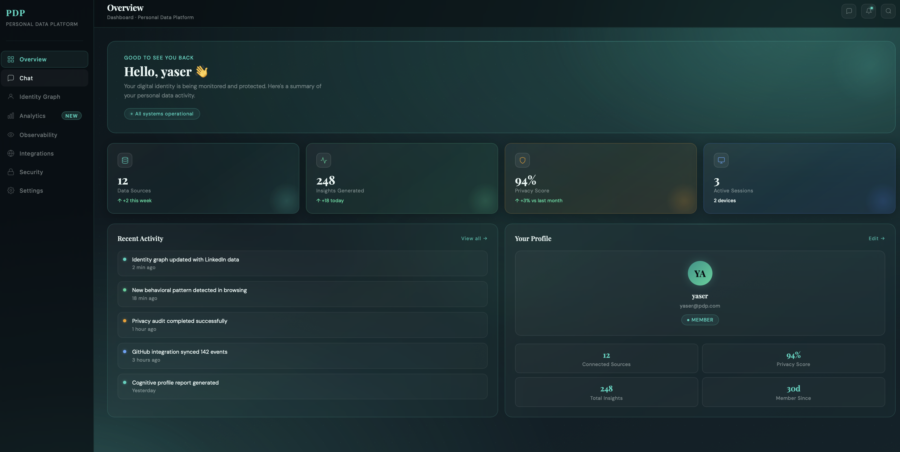
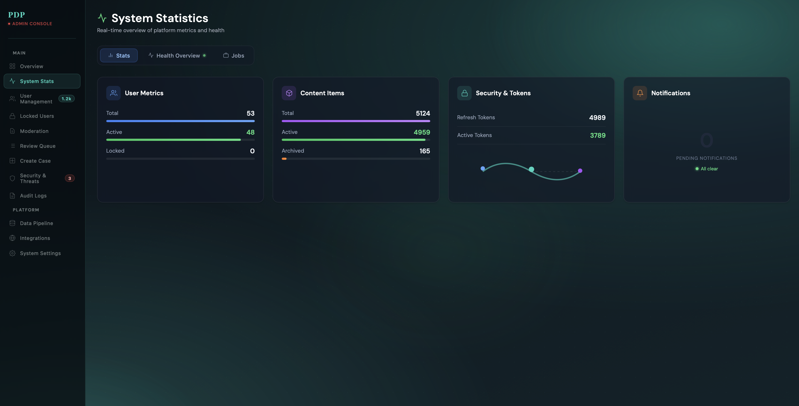
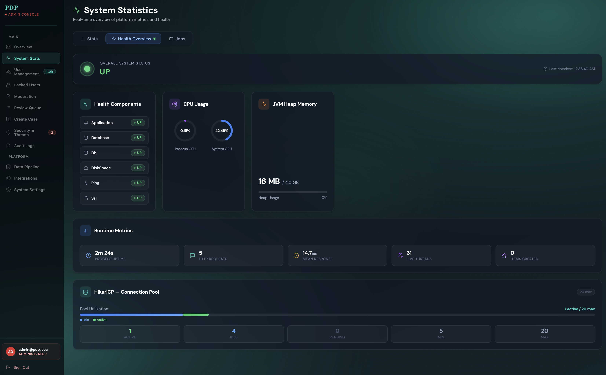
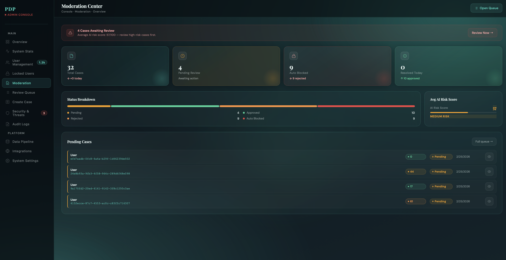

# PDP UI

Frontend application for the **Personal Data Platform (PDP)**, built with React + TypeScript + Vite.

This UI includes:
- Public landing and login pages
- Role-based routing (`ROLE_USER`, `ROLE_ADMIN`)
- User dashboard with chat experience
- Admin dashboard, system stats, locked users management, and moderation center

## Tech Stack

- **Framework:** React 19
- **Language:** TypeScript 5
- **Build Tool:** Vite 7
- **Routing:** React Router DOM 7
- **HTTP Client:** Axios
- **Auth Token Decode:** `jwt-decode`
- **Styling:** CSS Modules + global theme/variables CSS
- **Linting:** ESLint 9 + TypeScript ESLint + React Hooks rules

## Project Structure

```text
src/
  api/                 # Axios instance + API compatibility exports
  app/                 # App shell
  components/          # Shared UI and layout components
  features/
    auth/              # Login, auth context/provider
    home/              # Public landing page
    user/              # User dashboard pages
    chat/              # Chat UI + types
    dashboard/         # Admin dashboard pages
    stats/             # Admin system stats pages
    moderation/        # Moderation pages, components, services
    admin/             # Additional admin pages/components
  hooks/               # Reusable hooks (polling, toast)
  layouts/             # Public/User/Admin layouts
  router/              # Route definitions and guards
  services/            # Domain services (user/system/chat)
  styles/              # Global styles, theme, variables
```

## Architecture



## Routing Overview

- Public
  - `/`
  - `/login`
- User (guarded)
  - `/app`
  - `/app/chat`
- Admin (guarded)
  - `/admin`
  - `/admin/stats`
  - `/admin/users/locked`
  - `/admin/moderation`
  - `/admin/moderation/queue`
  - `/admin/moderation/new`

## Environment Variables

Create a `.env` file (or copy `.env.example`):

```bash
cp .env.example .env
```

Supported variables:

```env
VITE_API_BASE_URL=http://localhost:8080/api
```

If not set, frontend falls back to `http://localhost:8080/api`.

## Getting Started

```bash
npm install
npm run dev
```

App will run on Vite's default local server (usually `http://localhost:5173`).

## Available Scripts

```bash
npm run dev      # start development server
npm run build    # type-check + production build
npm run lint     # run ESLint
npm run preview  # preview production build
```

## UI Screenshots

## Screenshots

### Home


### Login


### User Dashboard


### Chat


### Admin Dashboard


### Admin Dashboard - 2


### Admin Dashboard - 3


### Admin Moderation 


## GitHub Public-Ready Checklist

- [x] Clear project README with architecture and setup
- [x] `.env` files ignored, `.env.example` provided
- [x] `node_modules` and build outputs ignored
- [x] No hardcoded private tokens found in source
- [x] Build and lint commands defined in `package.json`
- [ ] Initialize git in this folder (`git init`) if not already a repo
- [ ] Add a license (`LICENSE`) before publishing
- [ ] Add real screenshots for UI showcase
- [ ] Optional: add CI workflow for lint/build on pull requests

## Notes

- Authentication tokens are currently stored in `localStorage`.
- Role checks are enforced in UI routes with `RoleGuard`; backend authorization must remain the source of truth.

## License

No license file yet. Add one (for example `MIT`) before publishing publicly.
